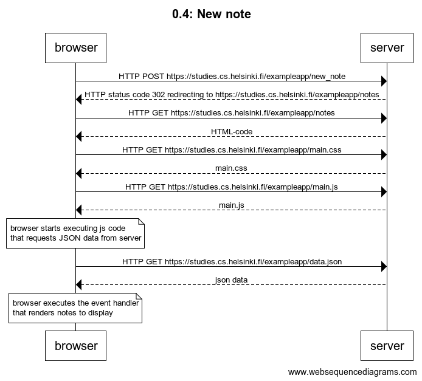
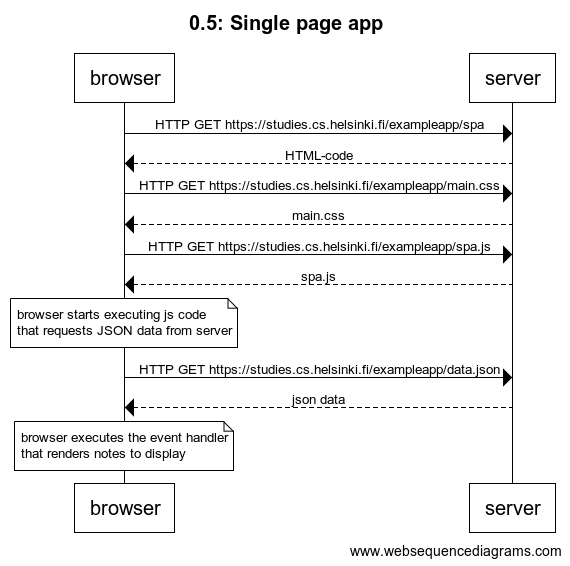
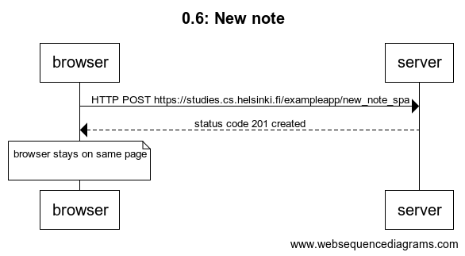

# 0.4: New note

browser->server: HTTP POST https://studies.cs.helsinki.fi/exampleapp/new_note
server-->browser: HTTP status code 302 redirecting to https://studies.cs.helsinki.fi/exampleapp/notes

browser->server: HTTP GET https://studies.cs.helsinki.fi/exampleapp/notes

server-->browser: HTML-code
browser->server: HTTP GET https://studies.cs.helsinki.fi/exampleapp/main.css
server-->browser: main.css
browser->server: HTTP GET https://studies.cs.helsinki.fi/exampleapp/main.js
server-->browser: main.js

note over browser:
browser starts executing js code
that requests JSON data from server 
end note

browser->server: HTTP GET https://studies.cs.helsinki.fi/exampleapp/data.json
server-->browser: json data

note over browser:
browser executes the event handler
that renders notes to display
end note

# 0.5: Single page app

browser->server: HTTP GET https://studies.cs.helsinki.fi/exampleapp/spa

server-->browser: HTML-code
browser->server: HTTP GET https://studies.cs.helsinki.fi/exampleapp/main.css
server-->browser: main.css
browser->server: HTTP GET https://studies.cs.helsinki.fi/exampleapp/spa.js
server-->browser: spa.js

note over browser:
browser starts executing js code
that requests JSON data from server 
end note

browser->server: HTTP GET https://studies.cs.helsinki.fi/exampleapp/data.json
server-->browser: json data

note over browser:
browser executes the event handler
that renders notes to display
end note

# 0.6: New note

browser->server: HTTP POST https://studies.cs.helsinki.fi/exampleapp/new_note_spa
server-->browser: status code 201 created

note over browser

browser stays on same page

end note

